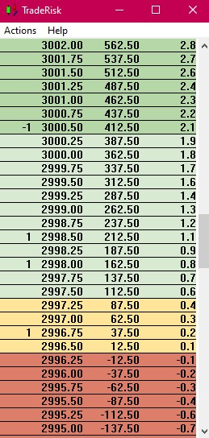

# Trade Risk Analyzer

__This is provided with no warranty and nothing this application says or does is considered financial advice__

This is just a tool to help analyze what-if scenarios when trading stocks or futures.

It provides a price ladder, and once you set your risk level, you can buy (left-click) and sell (right-click)
shares and watch how your risk and PnL are adjusted across price, both in dollars and in terms of risk multiples.

It is a win32 application, which means it is incredibly small and light by 2019 standards.  It was a fun
little project.

__This is provided with no warranty and nothing this application says or does is considered financial advice__

