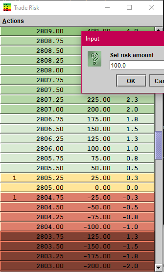

# Java Version

__This is provided with no warranty and nothing this application says or does is considered financial advice__

This is a Java/Swing version of the TradeRisk tool.  I have done others in
C/Win32 (this repo), and javascript/SPA (elsewhere on github), and even in
Excel spreadsheets.  This java version is mainly just an excuse to play with
making a virtualized listmodel in swing.

This is a modular (JPMS/Jigsaw) project, and an Ant build script is provided.
A recent Ant and JDK12 will build this with no problems.  There are no
external dependencies.

__This is provided with no warranty and nothing this application says or does is considered financial advice__
